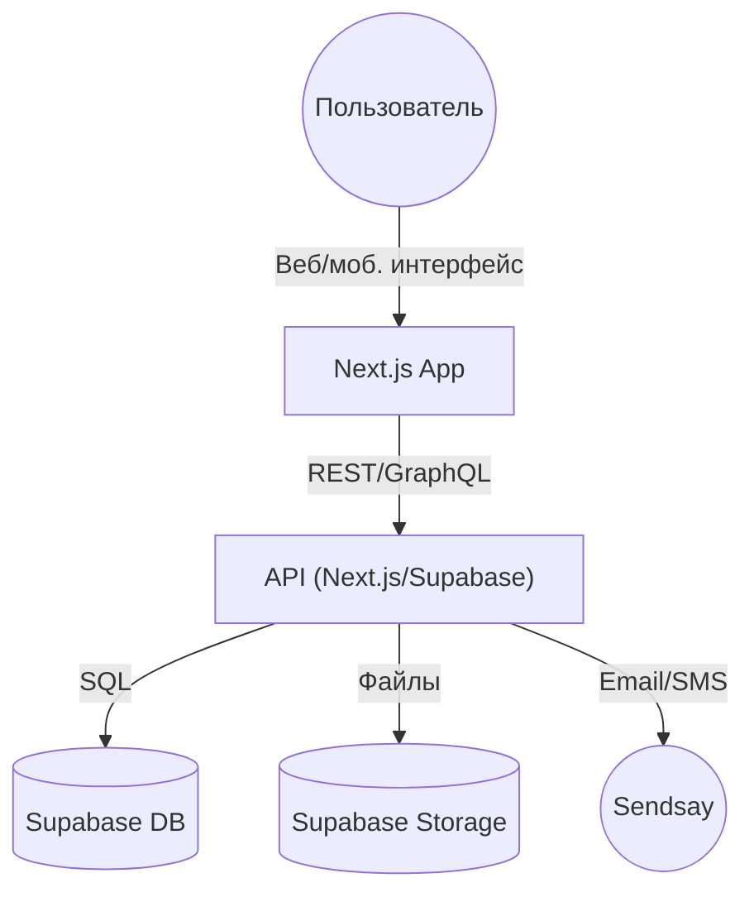

# FindThePuppy

## Описание проекта
FindThePuppy — это веб-сервис для поиска пропавших домашних животных. Владельцы могут публиковать объявления о пропаже, а другие пользователи — делиться информацией о найденных или замеченных животных.

## Цели
- Помочь владельцам быстрее находить пропавших питомцев
- Обеспечить удобный и безопасный обмен информацией
- Создать сообщество неравнодушных людей

## Архитектура
- **Frontend:** Next.js, React, TypeScript, TailwindCSS, Shadcn UI
- **Backend:** Next.js API routes, Supabase (PostgreSQL, Auth, Storage)
- **Интеграции:** Supabase, Sendsay (email/sms), внешние карты
- **Хостинг:** Vercel/виртуальный сервер

## Этапы разработки
1. Проектирование архитектуры и UI
2. Настройка репозитория и окружения
3. Реализация основных функций (объявления, поиск, отклики)
4. Интеграция Supabase и Sendsay
5. Тестирование и деплой
6. Документирование и поддержка

## Используемые технологии и стандарты
- React, Next.js, TypeScript, TailwindCSS, Shadcn UI, Radix UI
- Supabase (PostgreSQL, Auth, Storage)
- SOLID, KISS, DRY
- ESLint, Prettier, pre-commit hooks
- Документирование кода и процессов

## Требования к консистентности и поддерживаемости
- Единый стиль кода и документации
- Актуализация Project.md при изменениях архитектуры или требований
- Использование changelog и tasktracker для отслеживания изменений и задач

---
_Документ актуализируется при изменениях архитектуры или требований._ 